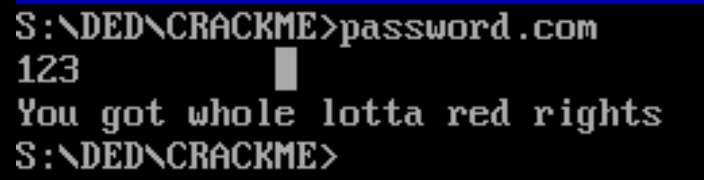

# Hard vulnerability found for PASSWORD.COM by Barkir
Hash function is bx = ax * cs:[di], where ax stores minutes from system clock and cs:di points to byte of key word. So if time is hh:00 hash for any input will be 0, so any input will give you rights.

